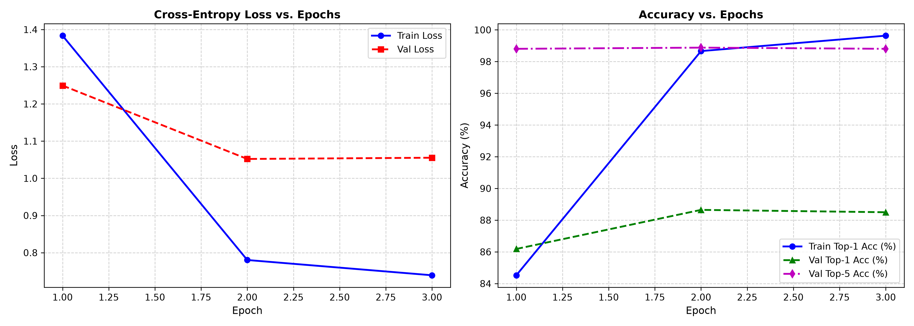

# รายงานสรุปผลการฝึกสอนโมเดล (Model Training Report)

**วันที่และเวลา:** 2026-08-28 18:33:04  
**โมเดล Architecture:** `mobilenetv3_large_100`  
**จำนวนคลาสทั้งหมด:** 104 Classes  
**ระยะเวลาการเทรนทั้งหมด:** 3579.43 วินาที (59.66 นาที)  

---

## 1. การกำหนดค่าไฮเปอร์พารามิเตอร์ (Hyperparameters)

| Parameter | Value |
| :--- | :--- |
| **Model Backbone** | `mobilenetv3_large_100` (Pretrained on ImageNet) |
| **Batch Size** | `64` |
| **Initial Learning Rate** | `0.0001` |
| **Optimizer** | `AdamW` (weight_decay=0.0001) |
| **LR Scheduler** | `CosineAnnealingLR` (T_max=2) |
| **Label Smoothing** | `0.08` |
| **Early Stopping Patience** | `5` epochs |
| **Device Used** | `auto` |

---

## 2. ผลลัพธ์ที่ดีที่สุด (Best Validation Results)

- **Best Epoch:** Epoch `2`
- **Best Validation Top-1 Accuracy:** **`88.65%`**
- **Best Validation Top-5 Accuracy:** **`98.88%`**
- **Validation Loss:** **`1.0520`**

---

## 3. ประวัติการเทรนในแต่ละ Epoch (Epoch History)

| Epoch | Train Loss | Train Acc (%) | Val Loss | Val Top-1 Acc (%) | Val Top-5 Acc (%) |
| :---: | :---: | :---: | :---: | :---: | :---: |
| 1 | 1.3836 | 84.52% | 1.2494 | 86.18% | 98.81% |
| 2 | 0.7803 | 98.66% | 1.0520 | 88.65% | 98.88% |
| 3 | 0.7393 | 99.63% | 1.0554 | 88.50% | 98.81% |

---

## 4. กราฟแสดงประสิทธิภาพ (Training Curves)

---

## 5. ขั้นตอนถัดไป (Next Steps)
- ทำการประเมินผลบนชุดทดสอบ (Test Set) ด้วยคำสั่ง `python src/evaluate.py`
- ทดสอบการทำนายภาพเดี่ยว (Inference) ด้วยคำสั่ง `python src/predict.py --image <path_to_image>`
